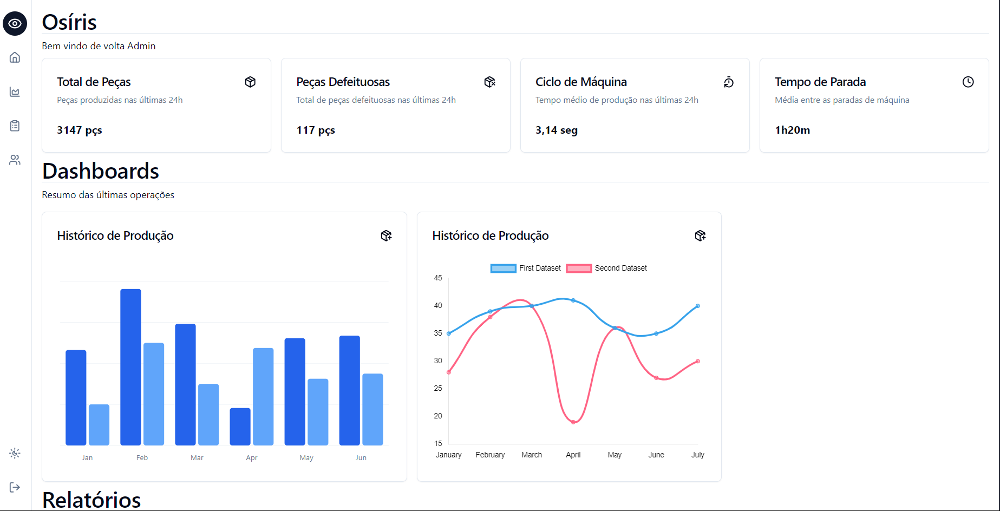
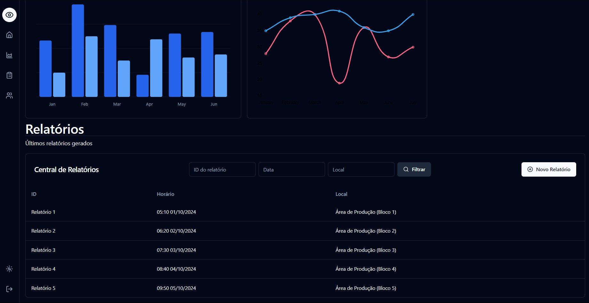

# Projeto Osiris 

## 📝 Descrição do Projeto

O **Projeto Osiris** tem como objetivo o desenvolvimento de uma solução de **monitoramento IoT (Internet das Coisas)**, permitindo o acompanhamento de sensores e/ou outros tipos equipamentos.

### 🎯 Objetivo

O principal objetivo é fornecer uma interface intuitiva e eficiente para monitorar dispositivos conectados à rede, exibir métricas de desempenho, e gerar relatórios detalhados que possam ser acessados facilmente pelos usuários.

### 🔧 Funcionalidades Principais

- **Monitoramento**: Acompanhamento de dados de sensores e dispositivos IoT.
- **Exibição Interativa**: Cards e gráficos dinâmicos para fácil visualização das informações.
- **Tabelas e Relatórios**: Exibição de dados estruturados para análise detalhada.

### 🎨 Wireframe

O design da interface foi criado utilizando o [Figma](https://www.figma.com/design/LSUJj8BEQqXBSAxqPDd5dz/Projeto-ERP?node-id=0-1&node-type=CANVAS&t=zlKnjMNjIq8ROp7T-0).

## 📊 Estrutura do Frontend

A interface do frontend foi projetada para ser altamente interativa e fácil de usar, com as seguintes características:

- **Cards**: Exibição de informações resumidas, como temperatura, status dos sensores, etc.
- **Dashboards**: Visualização completa e centralizada das métricas em gráficos dinâmicos.
- **Tabelas**: Apresentação de dados de forma organizada, permitindo a filtragem e o detalhamento das informações.

### 🔎 Tecnologias Utilizadas:

   

   

  

### 

